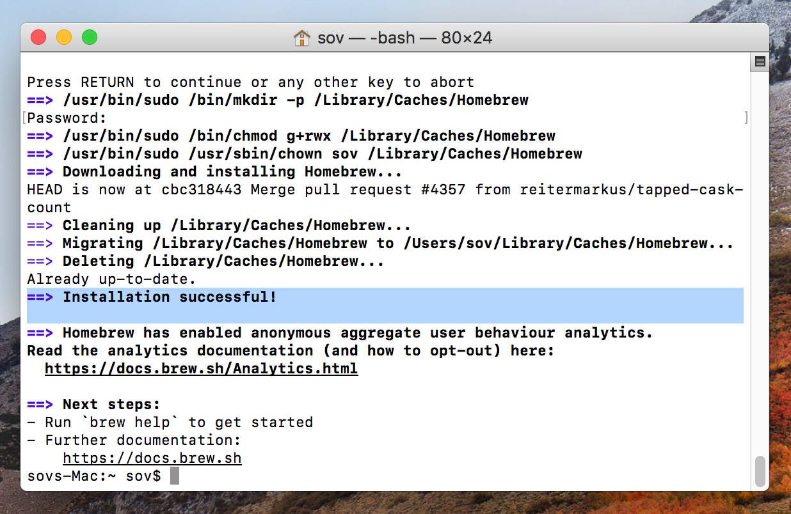
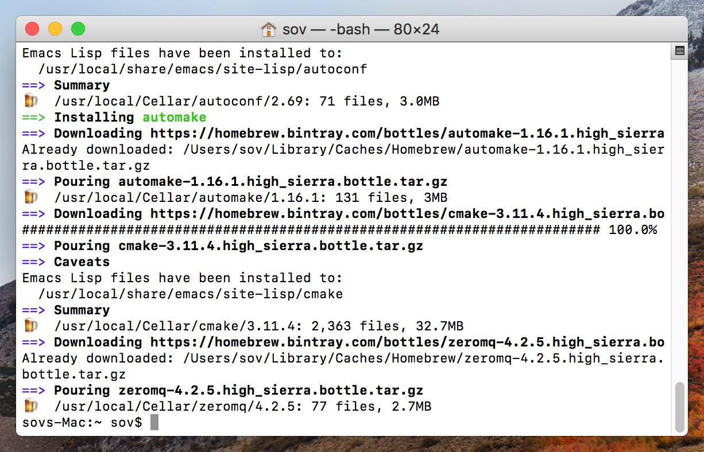

# How to Install Sovrin's Indy-SDK for MacOS

Sovrin is a non-profit organization building a transformational internet identity network that is freely available to everyone. Rather than hosting sensitive data in one location, Sovrin uses blockchain technology to keep all identity at the control of its owners, not corporations or governments. This will allow individuals much greater freedom in how they choose to share their identities.

Many computer programs are being developed that make use of Sovrin's identity network. To use these programs, you must first have a library of computer code installed on your computer, called Indy-SDK. This library is used by other programs so they can connect to the Sovrin Identity Network.

Windows users can simply download an installer program from the internet. However, a self-installing program is not yet available for Mac users. As such, this guide details how to manually install the Indy SDK on macOS.

For Windows and Linux users, follow the instructions in this link to install Indy-SDK: https://github.com/hyperledger/indy-sdk

**Time Required:** 10 minutes

**Materials Needed:**

- A computer that runs macOS Sierra (version 10.12) or higher
- An internet connection

&nbsp;

# Instructions

## 1. Open the Terminal

The terminal is a simple but powerful program preinstalled with all macOS computers. It allows the user to do anything that can be done with with an Internet browser, text editor, or other programs, but everything is instead presented with a textual interface.

The terminal may look daunting at first, but everything you need to type into it is explained below.

1. Open the terminal by searching for `Terminal` in the Applications/Utilities folder. A simple prompt should open up like this:

*Figure 1 — The terminal*

&nbsp;

## 2. Install Rust

Rust is the computer programming language that Indy is written in. In order to install Indy, Rust first needs to be on the computer to interpret the program.

1. Type the following line of code into the terminal:

        curl https://sh.rustup.rs -sSf | sh   
       
2. Press `Enter`.
3. When prompted, type in a `1` (Proceed with installation).
4. Press `Enter`.
5. Before continuing, some changes require the terminal to restart. Do so by **exiting** and then **reopening** the terminal.

*Figure 2 — Rust, installed*

&nbsp;

## 3. Install Homebrew

`Homebrew` is a terminal program that helps you install and manage other programs, similar to Apple's App Store. We will use this program to download several dependencies required for Indy.

1. Type the following line of code into the terminal: 

		/usr/bin/ruby -e "$(curl -fsSL https://raw.githubusercontent.com/Homebrew/install/master/install)"

2. Press `Enter`.
3. When prompted, press `Enter` once more. 
4. The terminal will then ask you to enter your user account password. This allow the terminal to make system changes and installations. 
    * **Note:**  You will not see your password as you type it in. This is to help keep your password secure.

*Figure 3 — Homebrew, installed*

&nbsp;

## 4. Install required dependencies

Several libraries of code are required by `indy`. Before downloading `indy`, you need to download these libraries, called dependencies, using Homebrew.

1. Type the following line of code into the terminal: 

		brew install pkg-config libsodium automake autoconf cmake openssl zeromq

2. Press `Enter`.

**Note:** If the terminal outputs any sort of error with `libzmq`, it may help to also run the command `brew install zmq`.

*Figure 4 — Dependencies correctly installed*

&nbsp;

## 5. Set OpenSSL Path

OpenSSL is a code library used by many other programs for enhanced internet security and encryption. We installed `openssl` in the last step, but one more step is needed.

The terminal uses environmental variables, which are pieces of data that are needed by multiple programs, stored in text form. For example, the `USER` environmental variable contains your username.

We need to set an environmental variable called `OPENSSL_DIR` which represents the directory or folder on your computer in which the `openssl` program was installed. 

1. To find that folder, type the following command into the terminal:

		ls /usr/local/Cellar/openssl

2. Press `Enter`.

	This will list the names of every file and folder within that directory. Since you only just installed `openssl`, there should only be one item, which is the version of `openssl` you installed. **The item name may vary from the screenshot.**

3. Type the following line of code into the terminal: 

		export OPENSSL_DIR=/usr/local/Cellar/openssl/<version_folder>

4. In the text that you just wrote in the terminal, replace `<version_folder>` with the output of the previous command, and press `Enter`. (See screenshot for an example)
5. Press `Enter`.

Unlike the other commands, this will not show any output. This is expected.

*Figure 5 — Running `ls` and `export` commands*

&nbsp;

## 6. Install Git

Github is a website that software developers use to host their computer programs. To interact with Github from the terminal, we will use `Homebrew` to install a program called `git`. This program will download `indy-sdk` for us without needing to use an internet browser.

1. Type the following line of code into the terminal: 

		brew install git

2. Press `Enter`.

*Figure 6 — Git, installed*

&nbsp;

## 7. Download and Build the `indy-sdk` library

With all prerequisites satisfied, you can now finish the process. The program `git` is used to download the indy programs and code onto the computer (also konwn as `clone`). Then `cd` changes the current directory to the folder where the code is located, similar to navigating to a different folder in Finder. Last, the command `cargo build` installs `indy` on the computer.

Copy the following three commands into the terminal and hit `Enter`. Note that you may need to hit enter one more time. The process may take a few minutes to download and install.

1. Type the following line of code into the terminal: 

		git clone https://github.com/hyperledger/indy-sdk

2. Press `Enter`.
3. Type the following line of code into the terminal: 
		
		cd ./indy-sdk/libindy

4. Press `Enter`.
5. Type the following line of code into the terminal: 

		cargo build

6. Press `Enter`.

The warning in the screenshot may be disregarded.

*Figure 7 — Indy successfully installed*

&nbsp;

The Indy libraries are now installed!
